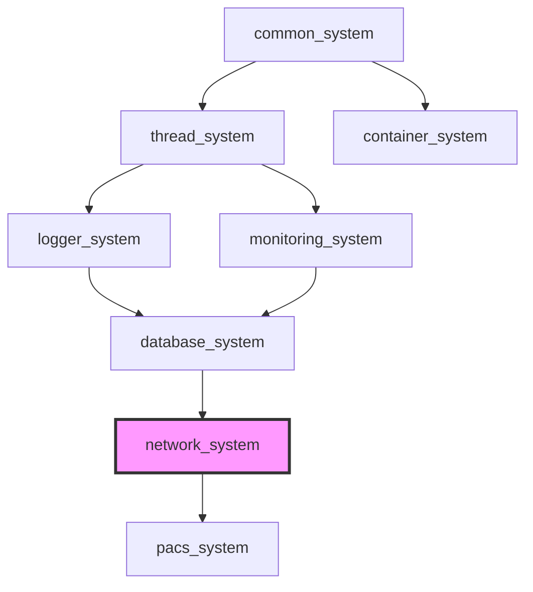

[](https://github.com/kcenon/network_system/actions/workflows/ci.yml)
[](https://github.com/kcenon/network_system/actions/workflows/code-quality.yml)
[](https://github.com/kcenon/network_system/actions/workflows/coverage.yml)
[](https://codecov.io/gh/kcenon/network_system)
[](https://github.com/kcenon/network_system/actions/workflows/build-Doxygen.yaml)
[](https://github.com/kcenon/network_system/blob/main/LICENSE)

# Network System

> **Language:** [English](README.md) | **한국어**

## 목차

- [개요](#개요)
- [vcpkg를 통한 설치](#vcpkg를-통한-설치)
- [요구사항](#요구사항)
- [빠른 시작](#빠른-시작)
- [모듈식 아키텍처](#모듈식-아키텍처-신규)
- [핵심 기능](#핵심-기능)
- [성능 하이라이트](#성능-하이라이트)
- [아키텍처 개요](#아키텍처-개요)
- [생태계 통합](#생태계-통합)
- [문서](#문서)
- [플랫폼 지원](#플랫폼-지원)
- [프로덕션 품질](#프로덕션-품질)
- [빌드 옵션](#빌드-옵션)
- [예제](#예제)
- [로드맵](#로드맵)
- [기여하기](#기여하기)
- [라이선스](#라이선스)

---

## 개요

분산 시스템과 메시징 애플리케이션을 위한 재사용 가능한 전송 프리미티브를 제공하는 현대적인 C++20 비동기 네트워크 라이브러리입니다. 향상된 모듈성과 생태계 전반의 재사용성을 위해 messaging_system에서 추출되었습니다.

**주요 특징**:
- 🏗️ **모듈식 아키텍처**: 플러그인 가능한 프로토콜 스택을 갖춘 코루틴 친화적 비동기 I/O
- ⚡ **고성능**: ASIO 기반 논블로킹 연산, 소형 페이로드에 대해 합성 벤치마크 기준 ~769K msg/s
- 🛡️ **프로덕션 등급**: 포괄적인 새니타이저 커버리지(TSAN/ASAN/UBSAN 클린), RAII Grade A, 다중 플랫폼 CI/CD
- 🔒 **보안**: TLS 1.2/1.3 지원, 인증서 검증, 최신 암호화 스위트
- 🌐 **크로스 플랫폼**: GCC, Clang, MSVC 지원과 함께 Ubuntu, Windows, macOS

---

## vcpkg를 통한 설치

### 빠른 시작

```bash
# Using overlay ports from the kcenon vcpkg registry
vcpkg install kcenon-network-system \
  --overlay-ports=path/to/kcenon/vcpkg-registry/ports

# With SSL and ecosystem features enabled
vcpkg install kcenon-network-system[ssl,ecosystem] \
  --overlay-ports=path/to/kcenon/vcpkg-registry/ports
```

> **레지스트리 기반 소비**: 이미 [kcenon/vcpkg-registry](https://github.com/kcenon/vcpkg-registry)를 사용하는 프로젝트라면, `vcpkg-configuration.json`에 레지스트리를 추가하고 `--overlay-ports` 없이 설치하세요.

### 기능 매트릭스

| 기능 | 기본값 | 설명 | 전이 의존성 |
|---------|---------|-------------|------------------------|
| (core) | always | 비동기 TCP/UDP, WebSocket, HTTP/1.1, TLS | common_system, thread_system, asio, openssl, zlib |
| `ssl` | off | 명시적 SSL/TLS 지원 플래그 | openssl >= 3.0.0 |
| `ecosystem` | off | Logger 및 container 통합 | logger_system, container_system |
| `testing` | off | 단위 테스트 및 벤치마크 | gtest, benchmark |
| `examples` | off | 사용 예제 | — |
| `docs` | off | Doxygen 문서 | — |

### CMake 통합

```cmake
find_package(network_system CONFIG REQUIRED)
target_link_libraries(your_target PRIVATE network_system::network_system)
```

표준 내보내기 타깃은 `network_system::network_system`입니다. 이 이름은 다운스트림 소비자를 위한 v1.0 안정 계약이며, 빌드 트리(FetchContent / add_subdirectory)와 설치 트리(`find_package`) 소비 양쪽에서 보장됩니다. 더 이상 사용되지 않는 타깃 표기는 내보내지지 않습니다.

### 최소 예제

```cpp
#include <kcenon/network/facade/tcp_facade.h>
#include <iostream>

int main() {
    auto server = kcenon::network::tcp_facade::create_server({
        .port = 9090,
        .on_message = [](auto session, auto data) {
            std::cout << "Received: " << data << std::endl;
        }
    });
    server->start();
    return 0;
}
```

---

## 요구사항

| 의존성 | 버전 | 필수 | 설명 |
|------------|---------|----------|-------------|
| C++20 컴파일러 | GCC 13+ / Clang 17+ / MSVC 2022+ / Apple Clang 14+ | 예 | thread_system 의존성으로 인한 상향 요구사항 |
| CMake | 3.20+ | 예 | 빌드 시스템 |
| ASIO | latest | 예 | 비동기 I/O (standalone) |
| OpenSSL | 3.x (권장) / 1.1.1 (최소) | 예 | TLS/SSL 지원 |
| [common_system](https://github.com/kcenon/common_system) | latest | 예 | 공통 인터페이스 및 Result<T> |
| [thread_system](https://github.com/kcenon/thread_system) | latest | 예 | 스레드 풀 및 비동기 연산 |
| [logger_system](https://github.com/kcenon/logger_system) | latest | 예 | 로깅 인프라 |
| [container_system](https://github.com/kcenon/container_system) | latest | 예 | 데이터 컨테이너 연산 |

> **OpenSSL 버전 참고**: OpenSSL 1.1.1은 2023년 9월 11일 지원 종료(End-of-Life)되었습니다.
> 지속적인 보안 지원을 위해 OpenSSL 3.x로의 업그레이드를 강력히 권장합니다.
> OpenSSL 1.1.1이 감지되면 빌드 시스템이 경고를 표시합니다.

### 의존성 흐름

```
network_system
├── common_system (required)
├── thread_system (required)
│   └── common_system
├── logger_system (required)
│   └── common_system
└── container_system (required)
    └── common_system
```

> **참고**: database_system과 달리 network_system은 monitoring_system에 대한 컴파일 타임 의존성을 가지지 **않습니다**. 관측성을 위해 network_system은 common_system을 통한 EventBus 기반 메트릭 발행을 사용합니다. 외부 모니터링 소비자(monitoring_system 포함)는 메트릭 수집을 위해 `network_metric_event`를 구독할 수 있습니다. 자세한 내용은 [모니터링 통합 가이드](docs/integration/with-monitoring.md)를 참고하세요.

### 의존성과 함께 빌드

```bash
# Clone all dependencies
git clone https://github.com/kcenon/common_system.git
git clone https://github.com/kcenon/thread_system.git
git clone https://github.com/kcenon/logger_system.git
git clone https://github.com/kcenon/container_system.git
git clone https://github.com/kcenon/network_system.git

# Build network_system
cd network_system
cmake -B build -DCMAKE_BUILD_TYPE=Release
cmake --build build
```

📖 **[빠른 시작 가이드 →](docs/guides/QUICK_START.md)**

---

## 빠른 시작

### 사전 준비

**Ubuntu/Debian** (Ubuntu 22.04+는 기본적으로 OpenSSL 3.x 제공):
```bash
sudo apt update
sudo apt install -y cmake ninja-build libasio-dev libssl-dev liblz4-dev zlib1g-dev
```

**macOS** (Homebrew를 통한 OpenSSL 3.x):
```bash
brew install cmake ninja asio openssl@3 lz4 zlib
```

**Windows (vcpkg)**:
```powershell
# vcpkg provides OpenSSL 3.x
vcpkg install openssl asio lz4 zlib --triplet x64-windows
```

**Windows (MSYS2)**:
```bash
pacman -S mingw-w64-x86_64-cmake mingw-w64-x86_64-ninja \
          mingw-w64-x86_64-asio mingw-w64-x86_64-openssl
```

### 빌드

```bash
git clone https://github.com/kcenon/network_system.git
cd network_system
cmake -B build -G Ninja -DCMAKE_BUILD_TYPE=Release
cmake --build build -j
```

### C++20 모듈 빌드 (실험적)

C++20 모듈 지원을 위해 (CMake 3.28+ 및 호환 컴파일러 필요):

```bash
cmake -B build -G Ninja -DCMAKE_BUILD_TYPE=Release -DNETWORK_BUILD_MODULES=ON
cmake --build build -j
```

모듈 사용:

```cpp
import kcenon.network;

int main() {
    auto server = std::make_unique<kcenon::network::core::messaging_server>("MyServer");
    server->start_server(8080);
    server->wait_for_stop();
}
```

### 첫 서버 (60초)

```cpp
#include <kcenon/network/core/messaging_server.h>
#include <iostream>

int main() {
    auto server = std::make_shared<kcenon::network::core::messaging_server>("MyServer");

    auto result = server->start_server(8080);
    if (result.is_err()) {
        const auto& err = result.error();
        std::cerr << "Failed to start: " << err.message
                  << " (code: " << err.code << ")" << std::endl;
        return -1;
    }

    std::cout << "Server running on port 8080..." << std::endl;
    server->wait_for_stop();
    return 0;
}
```

### 첫 클라이언트

```cpp
#include <kcenon/network/core/messaging_client.h>
#include <iostream>

int main() {
    auto client = std::make_shared<kcenon::network::core::messaging_client>("MyClient");

    auto result = client->start_client("localhost", 8080);
    if (result.is_err()) {
        const auto& err = result.error();
        std::cerr << "Failed to connect: " << err.message
                  << " (code: " << err.code << ")" << std::endl;
        return -1;
    }

    // Send message (std::move avoids extra copies)
    std::string message = "Hello, Network System!";
    std::vector<uint8_t> data(message.begin(), message.end());

    auto send_result = client->send_packet(std::move(data));
    if (send_result.is_err()) {
        const auto& err = send_result.error();
        std::cerr << "Failed to send: " << err.message
                  << " (code: " << err.code << ")" << std::endl;
    }

    client->wait_for_stop();
    return 0;
}
```

### 간소화된 Facade API (v2.0 신규)

더욱 간단한 사용을 위해 템플릿 복잡도를 숨기는 Facade API를 사용하세요:

```cpp
#include <kcenon/network/facade/tcp_facade.h>
#include <iostream>

int main() {
    using namespace kcenon::network;

    // Create server with declarative configuration
    facade::tcp_facade facade;
    auto server = facade.create_server({
        .port = 8080,
        .server_id = "MyServer"
    });

    // Set callbacks
    server->set_receive_callback([&](auto session_id, const auto& data) {
        std::cout << "Received " << data.size() << " bytes\n";
        // Echo back
        server->send(session_id, data);
    });

    // Start server
    auto result = server->start(8080);
    if (result.is_err()) {
        std::cerr << "Failed: " << result.error().message << "\n";
        return -1;
    }

    std::cout << "Server running on port 8080...\n";
    server->wait_for_stop();
    return 0;
}
```

**장점:**
- ✅ 템플릿 파라미터 없음
- ✅ 명확한 설정 구조체
- ✅ 프로토콜 비종속 인터페이스
- ✅ 직접 API와 동일한 성능

📖 **[전체 Facade 문서 →](docs/facades/README.md)**

---

## 모듈식 아키텍처 (신규)

v2.0부터 network_system은 유지보수성과 선택적 링크 향상을 위해 프로토콜별 라이브러리로 구성됩니다.

### 라이브러리 개요

| 라이브러리 | 설명 | 의존성 |
|---------|-------------|--------------|
| [`network-core`](libs/network-core/) | 핵심 인터페이스 및 세션 관리 | None |
| [`network-tcp`](libs/network-tcp/) | SSL/TLS 지원 TCP 프로토콜 | network-core, ASIO, OpenSSL |
| [`network-udp`](libs/network-udp/) | UDP 데이터그램 프로토콜 | network-core, ASIO |
| [`network-websocket`](libs/network-websocket/) | WebSocket (RFC 6455) | network-tcp |
| [`network-http2`](libs/network-http2/) | HTTP/2 멀티플렉스 프로토콜 | network-websocket |
| [`network-quic`](libs/network-quic/) | QUIC (RFC 9000) | network-udp, OpenSSL |
| [`network-grpc`](libs/network-grpc/) | gRPC 고성능 RPC | network-quic |
| [`network-all`](libs/network-all/) | 엄브렐러 패키지 (모든 프로토콜) | 위의 모든 것 |

### 의존성 그래프

```
                    network-core
                    /    |    \
                   /     |     \
            network-tcp  |  network-udp
                  |      |      |
         network-websocket    network-quic
                  |             |
              network-http2  network-grpc
```

### 선택적 링크

애플리케이션에 필요한 프로토콜만 링크하세요:

```cmake
# Option 1: All protocols (simple, larger binary)
find_package(network-all REQUIRED)
target_link_libraries(my_app PRIVATE kcenon::network-all)

# Option 2: Specific protocols (smaller binary)
find_package(network-tcp REQUIRED)
find_package(network-udp REQUIRED)
target_link_libraries(my_app PRIVATE
    kcenon::network-tcp
    kcenon::network-udp
)
```

### 엄브렐러 헤더

단일 헤더로 모든 프로토콜을 포함:

```cpp
#include <network_all/network.h>

// Check protocol availability at compile time
#if NETWORK_ALL_HAS_QUIC
    auto quic_conn = protocol::quic::connect({...});
#endif
```

📖 **[마이그레이션 가이드 →](docs/MIGRATION.md)** | **[라이브러리 README](libs/)**

---

## 핵심 기능

### 프로토콜

- **TCP**: 생명주기 관리를 갖춘 비동기 TCP 서버/클라이언트
  - 논블로킹 I/O, 자동 재연결, 헬스 모니터링
  - 멀티스레드 메시지 처리, 세션 관리

- **UDP**: 실시간 애플리케이션을 위한 비연결 UDP
  - 저지연 데이터그램 전송, 브로드캐스트/멀티캐스트 지원

- **TLS/SSL**: 보안 통신 (TLS 1.2/1.3)
  - 최신 암호화 스위트 (AES-GCM, ChaCha20-Poly1305)
  - 인증서 검증, 순방향 비밀성 (ECDHE)

- **WebSocket**: RFC 6455 준수
  - 텍스트 및 바이너리 메시지 프레이밍, ping/pong keepalive
  - 단편화/재조립, 우아한 연결 생명주기

- **HTTP/1.1**: 고급 기능을 갖춘 서버 및 클라이언트
  - 라우팅, 쿠키, multipart/form-data, 청크 인코딩
  - 자동 압축 (gzip/deflate)

- **QUIC**: RFC 9000/9001/9002 준수
  - TLS 1.3 암호화를 갖춘 UDP 기반 멀티플렉스 전송
  - 스트림 멀티플렉싱, 0-RTT 연결 재개
  - 손실 감지 및 혼잡 제어
  - 연결 마이그레이션 지원

- **gRPC**: 고성능 RPC 프레임워크 (신규)
  - network_system 통합을 갖춘 공식 gRPC 라이브러리 래퍼
  - 동적 메서드 등록을 갖춘 서비스 레지스트리
  - 모든 스트리밍 모드 (unary, server, client, bidirectional)
  - 헬스 체크 및 리플렉션 지원
  - Result<T>에서 gRPC Status로의 변환

📖 **[상세 프로토콜 문서 →](docs/FEATURES.md)**
📖 **[gRPC 가이드 →](docs/guides/GRPC_GUIDE.md)**

### 분산 추적

관측성을 위한 OpenTelemetry 호환 분산 추적:

- **W3C Trace Context**: 서비스 경계를 넘는 표준 컨텍스트 전파
- **RAII Span**: `NETWORK_TRACE_SPAN` 매크로를 통한 자동 span 생명주기 관리
- **다중 익스포터**: Console, OTLP HTTP/gRPC, Jaeger, Zipkin 지원
- **샘플링**: always-on, always-off, trace-id 기반, parent 기반 샘플러
- **풍부한 속성**: 문자열, 정수, 실수, 불리언 속성 및 이벤트

```cpp
#include <kcenon/network/tracing/tracing_config.h>
#include <kcenon/network/tracing/trace_context.h>

// Configure tracing (once at startup)
auto config = tracing_config::otlp_http("http://localhost:4318/v1/traces");
config.service_name = "my-service";
configure_tracing(config);

// Create spans using RAII
void process_request() {
    NETWORK_TRACE_SPAN("http.request.process");
    _span.set_attribute("http.method", "POST");
    _span.set_attribute("http.url", "/api/orders");

    // Child spans inherit trace context
    {
        auto db_span = trace_context::current().create_child_span("database.query");
        db_span.set_attribute("db.system", "postgresql");
        // ... perform database operation
        db_span.set_status(span_status::ok);
    }

    _span.set_status(span_status::ok);
}
```

📖 **[추적 가이드 →](docs/guides/tracing.md)**

### 비동기 모델

- **ASIO 기반**: 비동기 연산을 갖춘 논블로킹 이벤트 루프
- **C++20 코루틴**: 선택적 코루틴 기반 비동기 헬퍼
- **C++20 Concepts**: 명확한 오류 메시지를 갖춘 컴파일 타임 타입 검증
- **파이프라인 아키텍처**: 압축/암호화 훅을 갖춘 메시지 변환
- **Move 시맨틱**: Zero-copy 친화적 API (move-aware 버퍼 처리)

### 실패 처리
- 모든 서버/클라이언트 시작 헬퍼는 `Result<void>`를 반환합니다. 계속 진행하기 전에 `result.is_err()`를 확인하고 `result.error().message`를 로깅하세요.
- 과거 수정 사항(세션 정리, 백프레셔, TLS 롤아웃)에 대해서는 `IMPROVEMENTS.md`를 검토하여 이미 마련된 안전장치와 회귀 증상 재발 시 대응 방법을 이해하세요.
- 상위 수준 서비스를 구축할 때는 `common::error_info`를 스택 위로 전파하여 모니터링 및 알림 파이프라인이 계층 간 실패를 상관시킬 수 있도록 하세요.

### 오류 처리

**Result<T> 패턴** (75-80% 마이그레이션됨):
```cpp
auto result = server->start_server(8080);
if (result.is_err()) {
    const auto& err = result.error();
    std::cerr << "Error: " << err.message
              << " (code: " << err.code << ")\n";
    return -1;
}
```

**오류 코드** (-600 ~ -699):
- Connection (-600 ~ -619): `connection_failed`, `connection_refused`, `connection_timeout`
- Session (-620 ~ -639): `session_not_found`, `session_expired`
- Send/Receive (-640 ~ -659): `send_failed`, `receive_failed`, `message_too_large`
- Server (-660 ~ -679): `server_not_started`, `server_already_running`, `bind_failed`

---

## 성능 하이라이트

### 합성 벤치마크 (Intel i7-12700K, Ubuntu 22.04, GCC 11, `-O3`)

| 페이로드 | 처리량 | 지연 시간 (ns/op) | 범위 |
|---------|-----------|-----------------|-------|
| 64 bytes | ~769K msg/s | 1,300 | CPU 전용 (할당 + memcpy) |
| 256 bytes | ~305K msg/s | 3,270 | CPU 전용 (할당 + memcpy) |
| 1 KB | ~128K msg/s | 7,803 | CPU 전용 (할당 + memcpy) |
| 8 KB | ~21K msg/s | 48,000 | CPU 전용 (할당 + memcpy) |

### 실제 I/O 벤치마크 (루프백 TCP)

| 벤치마크 | 페이로드 | 범위 |
|-----------|---------|-------|
| TCP Connection Establish | N/A | 루프백을 통한 연결 + 연결 해제 |
| TCP Echo Roundtrip | 64B, 1KB, 8KB | 커널 TCP 스택을 통한 송신 + 수신 |
| TCP Stream Throughput | 1KB, 64KB | 루프백을 통한 지속 bytes/sec |

**참고**: 합성 벤치마크는 실제 네트워크 I/O 없이 CPU 전용 연산을 측정합니다. 실제 I/O 벤치마크는 루프백 인터페이스의 TCP 에코 서버를 사용하여 실제 커널 TCP 스택 오버헤드를 측정합니다.

### 벤치마크 재현

```bash
# Build with benchmarks
cmake -B build -DCMAKE_BUILD_TYPE=Release -DNETWORK_BUILD_BENCHMARKS=ON
cmake --build build -j

# Run all benchmarks
./build/benchmarks/network_benchmarks

# Run synthetic benchmarks only
./build/benchmarks/network_benchmarks --benchmark_filter=MessageThroughput

# Run real I/O benchmarks only
./build/benchmarks/network_benchmarks --benchmark_filter=TCP
```

⚡ **[전체 벤치마크 및 부하 테스트 →](docs/BENCHMARKS.md)**

**플랫폼**: Apple M1 @ 3.2GHz (Apple Silicon에서 테스트한 경우)

---

## 아키텍처 개요

```
┌─────────────────────────────────────────────────────────────────┐
│                    Network System Architecture                  │
├─────────────────────────────────────────────────────────────────┤
│  Public API Layer                                               │
│  ┌──────────────┐ ┌──────────────┐ ┌──────────────────────┐    │
│  │ messaging    │ │ messaging    │ │  messaging_ws        │    │
│  │ _server      │ │ _client      │ │  _server / _client   │    │
│  │ (TCP)        │ │ (TCP)        │ │  (WebSocket)         │    │
│  └──────────────┘ └──────────────┘ └──────────────────────┘    │
│  ┌──────────────────────┐ ┌─────────────────────────┐          │
│  │ secure_messaging     │ │ secure_messaging        │          │
│  │ _server (TLS/SSL)    │ │ _client (TLS/SSL)       │          │
│  └──────────────────────┘ └─────────────────────────┘          │
│  ┌──────────────────────┐ ┌─────────────────────────┐          │
│  │ messaging_quic       │ │ messaging_quic          │          │
│  │ _server (QUIC)       │ │ _client (QUIC)          │          │
│  └──────────────────────┘ └─────────────────────────┘          │
├─────────────────────────────────────────────────────────────────┤
│  Protocol Layer                                                 │
│  ┌──────────────┐ ┌──────────────┐ ┌──────────────────────┐    │
│  │ tcp_socket   │ │ udp_socket   │ │ websocket_socket     │    │
│  └──────────────┘ └──────────────┘ └──────────────────────┘    │
│  ┌──────────────────────┐ ┌──────────────────────────────┐     │
│  │ secure_tcp_socket    │ │ websocket_protocol           │     │
│  │ (SSL stream wrapper) │ │ (frame/handshake/msg handle) │     │
│  └──────────────────────┘ └──────────────────────────────┘     │
│  ┌──────────────────────────────────────────────────────────┐  │
│  │ protocols/quic/ (RFC 9000/9001/9002)                     │  │
│  │ connection, stream, packet, frame, crypto, varint        │  │
│  └──────────────────────────────────────────────────────────┘  │
├─────────────────────────────────────────────────────────────────┤
│  Session Management Layer                                       │
│  ┌──────────────┐ ┌──────────────┐ ┌────────────────────────┐  │
│  │ messaging    │ │ secure       │ │ ws_session_manager     │  │
│  │ _session     │ │ _session     │ │ (WebSocket mgmt)       │  │
│  │ (TCP)        │ │ (TLS/SSL)    │ │                        │  │
│  └──────────────┘ └──────────────┘ └────────────────────────┘  │
│  ┌────────────────────────────────────────────────────────────┐│
│  │ quic_session (QUIC session management)                     ││
│  └────────────────────────────────────────────────────────────┘│
├─────────────────────────────────────────────────────────────────┤
│  Core Network Engine (ASIO-based)                              │
│  ┌─────────────┐ ┌─────────────┐ ┌─────────────┐              │
│  │ io_context  │ │   async     │ │  Result<T>  │              │
│  │             │ │  operations │ │   pattern   │              │
│  └─────────────┘ └─────────────┘ └─────────────┘              │
└─────────────────────────────────────────────────────────────────┘
```

**디자인 패턴**: Factory, Observer, Strategy, RAII, Template Metaprogramming

🏛️ **[상세 아키텍처 가이드 →](docs/ARCHITECTURE.md)**

---

## 생태계 통합

### 생태계 의존성 맵



> **생태계 참조**:
> [common_system](https://github.com/kcenon/common_system) — Result&lt;T&gt;, 인터페이스, 공유 유틸리티
> [thread_system](https://github.com/kcenon/thread_system) — 스레드 풀 및 비동기 실행 프리미티브
> [container_system](https://github.com/kcenon/container_system) — 타입 안전 데이터 직렬화
> [logger_system](https://github.com/kcenon/logger_system) — 로깅 인프라
> [database_system](https://github.com/kcenon/database_system) — 데이터베이스 연산 (network_system에 의존)
> [pacs_system](https://github.com/kcenon/pacs_system) — DICOM/PACS 시스템 (network_system 소비)

### 관련 프로젝트

이 시스템은 다음과 매끄럽게 통합됩니다:

- **[messaging_system](https://github.com/kcenon/messaging_system)**: 고성능 메시지 라우팅 및 전달
- **[container_system](https://github.com/kcenon/container_system)**: 타입 안전 데이터 직렬화 (MessagePack, FlatBuffers)
- **[thread_system](https://github.com/kcenon/thread_system)**: 동시 연산을 위한 스레드 풀 관리
- **[logger_system](https://github.com/kcenon/logger_system)**: 포괄적인 네트워크 진단 및 로깅
- **[database_system](https://github.com/kcenon/database_system)**: 네트워크 기반 데이터베이스 연산 및 클러스터링

### 통합 예제

```cpp
#include <kcenon/network/core/messaging_server.h>
#include <kcenon/network/integration/thread_system_adapter.h>

using namespace kcenon::network;

int main() {
    // Bind thread_system for unified thread management
#if KCENON_WITH_THREAD_SYSTEM
    integration::bind_thread_system_pool_into_manager("network_pool");
#endif

    // Create and start server
    auto server = std::make_shared<core::messaging_server>("IntegratedServer");
    auto result = server->start_server(8080);

    if (result.is_err()) {
        std::cerr << "Failed: " << result.error().message << std::endl;
        return -1;
    }

    // Get thread pool metrics
    auto& manager = integration::thread_integration_manager::instance();
    auto metrics = manager.get_metrics();
    std::cout << "Workers: " << metrics.worker_threads << std::endl;

    server->wait_for_stop();
    return 0;
}
```

### 스레드 풀 어댑터

양방향 어댑터는 network_system의 스레드 풀과 common_system의 executor 간 상호 운용성을 가능하게 합니다:

```cpp
#include <kcenon/network/integration/thread_pool_adapters.h>

using namespace kcenon::network::integration;

// Use network_system pool where IExecutor is expected
auto network_pool = thread_integration_manager::instance().get_thread_pool();
auto executor = std::make_shared<network_to_common_thread_adapter>(network_pool);
// Pass executor to messaging_system, database_system, etc.

// Use external IExecutor in network_system
auto external_executor = container.resolve<common::interfaces::IExecutor>();
auto adapted = std::make_shared<common_to_network_thread_adapter>(external_executor);
thread_integration_manager::instance().set_thread_pool(adapted);
```

🌐 **[전체 통합 가이드 →](docs/INTEGRATION.md)**

---

## 문서

### 시작하기
- 📖 [기능 가이드](docs/FEATURES.md) - 포괄적인 기능 설명
- 🏗️ [아키텍처](docs/ARCHITECTURE.md) - 시스템 설계 및 패턴
- 📘 [API 레퍼런스](docs/API_REFERENCE.md) - 완전한 API 문서
- 🔧 [빌드 가이드](docs/guides/BUILD.md) - 상세 빌드 지침
- 🚀 [마이그레이션 가이드](docs/MIGRATION.md) - messaging_system에서의 마이그레이션

#### 생성된 API 문서 (Doxygen)

v1.0 공개 API에 대한 전체 Doxygen 생성 레퍼런스는 `main` 브랜치에서 [Generate-Documentation 워크플로](.github/workflows/build-Doxygen.yaml)에 의해 발행되며 GitHub Pages에 호스팅됩니다:

- https://kcenon.github.io/network_system/

HTML을 로컬에서 재생성하려면:

```bash
doxygen Doxyfile
# Output: documents/html/index.html
```

[Doxygen Warnings Check 워크플로](.github/workflows/doxygen-warnings-check.yml)는 모든 PR에서 실행되며 `include/kcenon/network/`(단, `detail/` 제외) 아래 헤더가 Doxygen 경고를 방출하면 빌드를 실패시킵니다. 이는 [docs/v1.0-api-surface.md](docs/v1.0-api-surface.md)에 정의된 v1.0 공개 API 표면을 문서 회귀로부터 보호합니다.

### 고급 주제
- ⚡ [성능 및 벤치마크](docs/BENCHMARKS.md) - 성능 메트릭 및 테스트
- 🏭 [프로덕션 품질](docs/PRODUCTION_QUALITY.md) - CI/CD, 보안, 품질 보증
- 📁 [프로젝트 구조](docs/PROJECT_STRUCTURE.md) - 디렉터리 구성 및 모듈
- 🧩 [C++20 Concepts](docs/advanced/CONCEPTS.md) - 컴파일 타임 타입 검증
- 🔒 [TLS 설정 가이드](docs/guides/TLS_SETUP_GUIDE.md) - TLS/SSL 구성
- 🔍 [문제 해결](docs/guides/TROUBLESHOOTING.md) - 일반적인 문제 및 해결책
- 🧪 [부하 테스트 가이드](docs/guides/LOAD_TEST_GUIDE.md) - 부하 테스트 절차
- 📝 [설계 결정](docs/DESIGN_DECISIONS.md) - 아키텍처 패턴 및 근거

### 개발
- 🔄 [통합 가이드](docs/INTEGRATION.md) - 생태계 통합 패턴
- 📊 [운영 가이드](docs/advanced/OPERATIONS.md) - 배포 및 운영
- 📋 [변경 이력](docs/CHANGELOG.md) - 버전 이력 및 업데이트

---

## 플랫폼 지원

| 플랫폼 | 컴파일러 | 아키텍처 | 지원 수준 |
|----------|----------|--------------|---------------|
| Ubuntu 22.04+ | GCC 13+ | x86_64, ARM64 | ✅ 완전 지원 |
| Ubuntu 22.04+ | Clang 17+ | x86_64, ARM64 | ✅ 완전 지원 |
| Windows 2022+ | MSVC 2022+ | x86_64 | ✅ 완전 지원 |
| Windows 2022+ | MinGW64 | x86_64 | ✅ 완전 지원 |
| macOS 12+ | Apple Clang 14+ | x86_64, ARM64 | ✅ 완전 지원 |

---

## 프로덕션 품질

### CI/CD 인프라

**포괄적인 다중 플랫폼 테스트**:
- ✅ **새니타이저 커버리지**: ThreadSanitizer, AddressSanitizer, UBSanitizer
- ✅ **다중 플랫폼**: Ubuntu (GCC/Clang), Windows (MSVC/MinGW), macOS
- ✅ **성능 게이트**: 자동 회귀 감지
- ✅ **정적 분석**: modernize 검사를 갖춘 clang-tidy, cppcheck
- ✅ **코드 커버리지**: Codecov 통합과 함께 ~80%

### 보안

**TLS/SSL 구현**:
- TLS 1.2/1.3 프로토콜 지원
- 최신 암호화 스위트 (AES-GCM, ChaCha20-Poly1305)
- 순방향 비밀성 (ECDHE), 인증서 검증
- 호스트네임 검증, 선택적 인증서 피닝

**추가 보안**:
- 입력 검증 및 버퍼 오버플로 보호
- WebSocket origin 검증 및 프레임 마스킹
- HTTP 요청 크기 제한 및 경로 순회 보호
- 쿠키 보안 (HttpOnly, Secure, SameSite)

### 스레드 안전성 및 메모리 안전성

**스레드 안전성**:
- ✅ 포괄적인 동기화 (mutex, atomic, shared_mutex)
- ✅ ThreadSanitizer 클린 (데이터 레이스 제로)
- ✅ 동시 세션 처리 테스트됨

**메모리 안전성** (RAII Grade A):
- ✅ 100% 스마트 포인터 사용 (`std::shared_ptr`, `std::unique_ptr`)
- ✅ 수동 메모리 관리 제로
- ✅ AddressSanitizer 클린 (누수 제로, 버퍼 오버플로 제로)
- ✅ RAII를 통한 자동 리소스 정리

🛡️ **[전체 프로덕션 품질 가이드 →](docs/PRODUCTION_QUALITY.md)**

---

## 의존성

### 필수
- **C++20** 호환 컴파일러 (GCC 13+, Clang 17+, MSVC 2022+, Apple Clang 14+)

> **참고**: 상향된 GCC/Clang 요구사항은 [thread_system](https://github.com/kcenon/thread_system) 의존성에서 비롯되며, 이는 완전한 C++20 기능 지원을 위해 GCC 13+ 및 Clang 17+를 요구합니다.
- **CMake** 3.20+
- **ASIO** 또는 **Boost.ASIO** 1.28+
- **OpenSSL** 3.x 권장 / 1.1.1+ 최소 (TLS/SSL 및 WebSocket용)
- **[common_system](https://github.com/kcenon/common_system)** (Result<T> 패턴, 공통 인터페이스)
- **[thread_system](https://github.com/kcenon/thread_system)** (스레드 풀 통합)
- **[logger_system](https://github.com/kcenon/logger_system)** (구조화된 로깅)
- **[container_system](https://github.com/kcenon/container_system)** (데이터 컨테이너 연산)
- **fmt** 10.0.0+ (포맷팅 라이브러리)
- **zlib** (압축 지원)

---

## 빌드 옵션

### CMake 프리셋 사용 (권장)

CMake 프리셋은 표준화된 빌드 구성을 제공합니다:

```bash
# List available presets
cmake --list-presets

# Configure with a preset
cmake --preset debug          # Debug build
cmake --preset release        # Release build
cmake --preset asan           # AddressSanitizer
cmake --preset tsan           # ThreadSanitizer
cmake --preset ubsan          # UndefinedBehaviorSanitizer
cmake --preset coverage       # Code coverage

# Build
cmake --build --preset debug

# Test with sanitizer-specific environment
ctest --preset asan           # Runs with ASAN_OPTIONS configured
ctest --preset tsan           # Runs with TSAN_OPTIONS configured
```

### 수동 CMake 구성

```bash
# Basic build
cmake -B build -DCMAKE_BUILD_TYPE=Release
cmake --build build -j

# With sanitizers (mutually exclusive)
cmake -B build -DCMAKE_BUILD_TYPE=Debug -DENABLE_ASAN=ON   # AddressSanitizer
cmake -B build -DCMAKE_BUILD_TYPE=Debug -DENABLE_TSAN=ON   # ThreadSanitizer
cmake -B build -DCMAKE_BUILD_TYPE=Debug -DENABLE_UBSAN=ON  # UndefinedBehaviorSanitizer

# With benchmarks
cmake -B build -DCMAKE_BUILD_TYPE=Release \
    -DNETWORK_BUILD_BENCHMARKS=ON

# With tests
cmake -B build -DCMAKE_BUILD_TYPE=Release \
    -DBUILD_TESTS=ON

# With optional integrations
cmake -B build -DCMAKE_BUILD_TYPE=Release \
    -DBUILD_WITH_THREAD_SYSTEM=ON \
    -DBUILD_WITH_LOGGER_SYSTEM=ON \
    -DBUILD_WITH_CONTAINER_SYSTEM=ON

# Build and run tests
cmake --build build -j
cd build && ctest --output-on-failure
```

### 빌드 디렉터리 정리

모든 빌드 디렉터리를 한 번에 제거하려면:

```bash
./scripts/clean.sh
```

> **팁**: 수동 `mkdir build_*` 디렉터리보다 `cmake --preset <name>`을 선호하세요.
> 명명된 프리셋은 일관되고 재현 가능한 빌드를 생성하며 빌드 디렉터리 증식을 방지합니다.

### 사용 가능한 CMake 옵션

| 옵션 | 기본값 | 설명 |
|--------|---------|-------------|
| `BUILD_TESTS` | ON | 단위 테스트 빌드 |
| `BUILD_EXAMPLES` | ON | 사용 예제 빌드 |
| `BUILD_TLS_SUPPORT` | ON | TLS/SSL 지원 활성화 |
| `BUILD_WEBSOCKET_SUPPORT` | ON | WebSocket 프로토콜 활성화 |
| `NETWORK_BUILD_BENCHMARKS` | OFF | 성능 벤치마크 빌드 |
| `ENABLE_ASAN` | OFF | AddressSanitizer 활성화 |
| `ENABLE_TSAN` | OFF | ThreadSanitizer 활성화 |
| `ENABLE_UBSAN` | OFF | UndefinedBehaviorSanitizer 활성화 |
| `ENABLE_COVERAGE` | OFF | 코드 커버리지 활성화 |
| `NETWORK_ENABLE_GRPC_OFFICIAL` | OFF | 공식 gRPC 라이브러리 사용 |

---

## 예제

완전한 예제는 `examples/` 디렉터리에서 확인할 수 있습니다:

- **basic_usage.cpp** - 기본 TCP 클라이언트/서버
- **tcp_echo_server.cpp** - 세션 관리를 갖춘 TCP 서버
- **tcp_client.cpp** - facade API를 사용하는 TCP 클라이언트
- **simple_http_server.cpp** - 라우팅을 갖춘 HTTP 서버
- **simple_http_client.cpp** - 다양한 요청 타입을 갖춘 HTTP 클라이언트
- **websocket_chat.cpp** - WebSocket 채팅 서버 및 클라이언트
- **quic_server_example.cpp** - 멀티 스트림 지원을 갖춘 QUIC 서버
- **quic_client_example.cpp** - 스트림 멀티플렉싱을 갖춘 QUIC 클라이언트
- **grpc_service_example.cpp** - gRPC 서비스 등록 및 관리

예제 빌드 및 실행:
```bash
cmake -B build -DBUILD_EXAMPLES=ON
cmake --build build
./build/bin/examples/example_tcp_echo_server
./build/bin/examples/example_tcp_client
```

---

## 로드맵

### 최근 완료
- ✅ **QUIC 프로토콜 지원**: RFC 9000/9001/9002 준수 구현
- ✅ **gRPC 통합**: 완전한 스트리밍 지원을 갖춘 공식 gRPC 라이브러리 래퍼

### 현재 집중 영역
- 🚧 실제 네트워크 부하 테스트 검증 및 기준선 수립
- 🚧 완전한 Result<T> 마이그레이션 (현재 75-80%)
- 🚧 문서 예제 업데이트

### 계획된 기능
- 🚧 **연결 풀링**: 엔터프라이즈급 연결 관리
- 🚧 **Zero-Copy 파이프라인**: 불필요한 버퍼 복사 제거
- 🚧 **HTTP/2 클라이언트**: 최신 HTTP/2 프로토콜 지원

완료된 작업 및 진행 중인 항목은 [변경 이력](docs/CHANGELOG.md)을 참고하세요.

---

## 기여하기

기여를 환영합니다! 자세한 지침은 [기여 가이드](docs/contributing/CONTRIBUTING.md)를 참고하세요.

1. 리포지토리 포크
2. 기능 브랜치 생성 (`git checkout -b feature/amazing-feature`)
3. [기여 가이드](docs/contributing/CONTRIBUTING.md)의 코딩 표준 준수
4. conventional commit으로 변경 사항 커밋
5. 브랜치에 푸시 (`git push origin feature/amazing-feature`)
6. Pull Request 열기

**제출 전**:
- 모든 테스트 통과 확인 (`ctest`)
- 새니타이저 실행 (TSAN, ASAN, UBSAN)
- 코드 포맷팅 확인 (`clang-format`)
- 필요에 따라 문서 업데이트

---

## 라이선스

이 프로젝트는 BSD 3-Clause 라이선스에 따라 배포됩니다 - 자세한 내용은 [LICENSE](LICENSE) 파일을 참고하세요.

---

## 연락처 및 지원

| 연락 유형 | 상세 |
|--------------|---------|
| **프로젝트 소유자** | kcenon (kcenon@naver.com) |
| **리포지토리** | https://github.com/kcenon/network_system |
| **이슈 및 버그 리포트** | https://github.com/kcenon/network_system/issues |
| **토론 및 질문** | https://github.com/kcenon/network_system/discussions |

---

## 감사의 말

### 핵심 의존성
- **ASIO Library Team**: 비동기 네트워크 프로그래밍의 기반
- **C++ Standards Committee**: 현대적 네트워킹을 가능하게 하는 C++20 기능

### 생태계 통합
- **Thread System**: 매끄러운 스레드 풀 통합
- **Logger System**: 포괄적인 로깅 및 디버깅
- **Container System**: 고급 직렬화 지원
- **Database System**: 네트워크-데이터베이스 통합 패턴
- **Monitoring System**: 성능 메트릭 및 관측성

---

<p align="center">
  Made with ❤️ by 🍀☀🌕🌥 🌊
</p>
