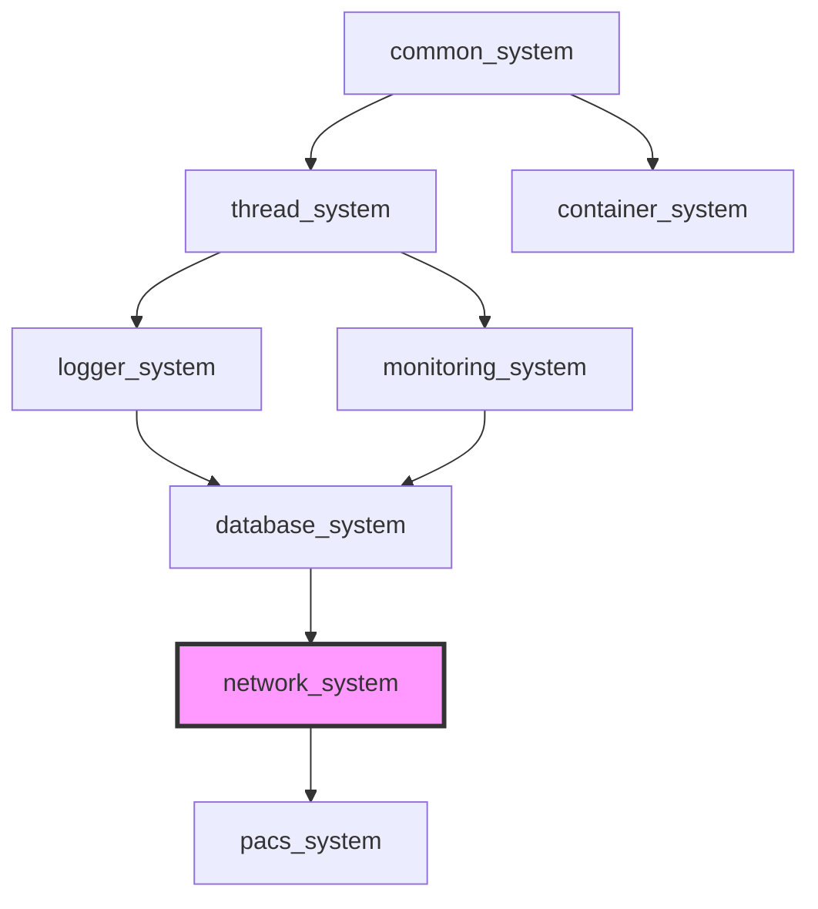

# Network System Architecture - Overview

> **SSOT**: This document is part of the Network System Architecture. See also [Architecture - Protocols](ARCHITECTURE_PROTOCOLS.md) and the [Architecture Index](ARCHITECTURE.md).

> **Language:** **English** | [한국어](ARCHITECTURE.kr.md)

> **Cross-reference**:
> [API Reference](./API_REFERENCE.md) — Public API details for all network components
> [Integration Guide](./INTEGRATION.md) — Ecosystem integration patterns and adapters
> [Facade Guide](./FACADE_GUIDE.md) — Simplified protocol facade API documentation
> [Design Decisions](./DESIGN_DECISIONS.md) — ADRs and rationale for architectural choices

> **Ecosystem reference**:
> [common_system Result&lt;T&gt;](https://github.com/kcenon/common_system/blob/main/docs/API_REFERENCE.md) — Error handling base used throughout network operations
> [thread_system Thread Pool](https://github.com/kcenon/thread_system/blob/main/docs/ARCHITECTURE.md) — Thread pool architecture integrated via adapters
> [container_system Serialization](https://github.com/kcenon/container_system/blob/main/docs/API_REFERENCE.md) — Message serialization for network payloads
> [logger_system Logging](https://github.com/kcenon/logger_system/blob/main/docs/ARCHITECTURE.md) — Logging infrastructure for network diagnostics

This document provides a comprehensive architectural overview of network_system, a high-performance asynchronous networking library built on ASIO (Asynchronous I/O). Originally extracted from messaging_system for enhanced modularity and reusability, network_system delivers 305K+ messages/second with sub-microsecond latency through zero-copy pipelines and efficient connection management.

**Version**: 0.1.0.0
**Last Updated**: 2025-10-22
**Architecture Style**: Layered, Asynchronous, Event-Driven


## Table of Contents

- [Purpose & Design Goals](#purpose--design-goals)
- [Architecture Layers](#architecture-layers)
- [Core Components](#core-components)
- [Integration Architecture](#integration-architecture)
- [Build Configuration](#build-configuration)
- [Design Patterns](#design-patterns)
- [Ecosystem Dependencies](#ecosystem-dependencies)
- [References](#references)

---

## Purpose & Design Goals

### Primary Purpose

Network_system provides a high-performance networking foundation that:

- **Abstracts complexity**: Simplifies asynchronous network programming through intuitive APIs
- **Maximizes performance**: Achieves 305K+ msg/s through zero-copy and efficient I/O
- **Enables modularity**: Cleanly separates from messaging layer for reusability
- **Supports integration**: Pluggable interfaces for thread, logger, and container systems

### Design Goals

| Goal | Description | Status |
|------|-------------|--------|
| **High Performance** | Sub-microsecond latency, 300K+ msg/s throughput | ✅ Achieved |
| **Zero-Copy I/O** | Direct memory mapping for network operations | ✅ Achieved |
| **Modularity** | Independent from messaging_system | ✅ Achieved |
| **Async-First** | Coroutine-based async operations (C++20) | ✅ Achieved |
| **Integration-Friendly** | Pluggable thread, logger, container systems | ✅ Achieved |
| **Connection Pooling** | Efficient connection reuse | 🔄 In Progress |
| **TLS/SSL Support** | Secure communication (TLS 1.3, DTLS) | ✅ Achieved |


---

## Architecture Layers

Network_system follows a layered architecture with clear separation of concerns:

```
┌─────────────────────────────────────────────────────────────┐
│                   Application Layer                         │
│         (messaging_system, database_system, etc.)           │
└─────────────────────────┬───────────────────────────────────┘
                          │ uses
┌─────────────────────────▼───────────────────────────────────┐
│                  Facade Layer (NEW in v2.0)                 │
│  ┌────────────────────────────────────────────────────┐    │
│  │  tcp_facade  │  udp_facade  │  websocket_facade   │    │
│  │  http_facade │  quic_facade                       │    │
│  │  ────────────────────────────────────────────────  │    │
│  │  - Simplified API      - No template parameters   │    │
│  │  - Unified interfaces  - Zero-cost abstraction    │    │
│  └────────────────────────────────────────────────────┘    │
└────────────────────────┬────────────────────────────────────┘
                          │ creates
┌─────────────────────────▼───────────────────────────────────┐
│                  Core Layer (Public API)                    │
│  ┌────────────────────────────────────────────────────┐    │
│  │  MessagingServer  │  MessagingClient               │    │
│  │  ────────────────────────────────────────────────  │    │
│  │  - Connection management   - Session lifecycle    │    │
│  │  - Message routing         - Event callbacks      │    │
│  └────────────────────────────────────────────────────┘    │
└────────────────────────┬────────────────────────────────────┘
                         │
┌────────────────────────▼────────────────────────────────────┐
│              Session Management Layer                       │
│  ┌────────────────────────────────────────────────────┐    │
│  │  MessagingSession  │  SessionManager              │    │
│  │  ────────────────────────────────────────────────  │    │
│  │  - Active connections   - Lifecycle management    │    │
│  │  - Read/Write ops       - Session pooling         │    │
│  └────────────────────────────────────────────────────┘    │
└────────────────────────┬────────────────────────────────────┘
                         │
┌────────────────────────▼────────────────────────────────────┐
│              Internal Implementation Layer                  │
│  ┌────────────────────────────────────────────────────┐    │
│  │  TCPSocket  │  Pipeline  │  Coroutines            │    │
│  │  ────────────────────────────────────────────────  │    │
│  │  - ASIO wrapper        - Zero-copy buffer         │    │
│  │  - Socket operations   - Send/Receive coroutines  │    │
│  └────────────────────────────────────────────────────┘    │
└────────────────────────┬────────────────────────────────────┘
                         │
┌────────────────────────▼────────────────────────────────────┐
│              Integration Layer (Pluggable)                  │
│  ┌────────────────────────────────────────────────────┐    │
│  │  Thread Integration  │  Logger Integration        │    │
│  │  Container Integration │  Common System           │    │
│  └────────────────────────────────────────────────────┘    │
└─────────────────────────────────────────────────────────────┘
                         │
┌────────────────────────▼────────────────────────────────────┐
│              Platform Layer (ASIO)                          │
│  ┌────────────────────────────────────────────────────┐    │
│  │  Boost.ASIO / Standalone ASIO                      │    │
│  │  - I/O Context    - Async Operations               │    │
│  │  - TCP Sockets    - Event Loop                     │    │
│  └────────────────────────────────────────────────────┘    │
└─────────────────────────────────────────────────────────────┘
```

### Layer Descriptions

#### 0. Facade Layer (NEW in v2.0)

**Purpose**: Provide simplified, template-free API for protocol client/server creation

**Components**:
- `tcp_facade`: TCP client/server with optional SSL/TLS
- `udp_facade`: UDP datagram client/server
- `websocket_facade`: WebSocket client/server (RFC 6455)
- `http_facade`: HTTP/1.1 client/server
- `quic_facade`: QUIC client/server (RFC 9000/9001/9002)

**Responsibilities**:
- Hide template parameters and protocol tags from users
- Provide declarative configuration via config structs
- Return unified `i_protocol_client`/`i_protocol_server` interfaces
- Enable protocol-agnostic application code
- Zero-cost abstraction (no performance overhead)

**Design Pattern**: Facade pattern for simplified interface

**Usage Example**:
```cpp
tcp_facade facade;
auto client = facade.create_client({
    .host = "127.0.0.1",
    .port = 8080,
    .use_ssl = true
});
client->start("127.0.0.1", 8080);
```

📖 **See:** [Facade API Documentation](facades/README.md) | [Migration Guide](facades/migration-guide.md)

#### 1. Core Layer (Public API)

**Purpose**: Provide high-level networking abstractions for applications

**Components**:
- `MessagingServer`: TCP server with multi-client support
- `MessagingClient`: TCP client with reconnection support
- Public APIs for send/receive operations

**Responsibilities**:
- Connection lifecycle management
- Message routing and dispatching
- Event callback registration (on_connect, on_disconnect, on_message)

#### 2. Session Management Layer

**Purpose**: Manage active network sessions and their lifecycle

**Components**:
- `MessagingSession`: Represents an active connection
- `SessionManager`: Manages session pool and lifecycle

**Responsibilities**:
- Session creation and destruction
- Read/Write buffer management
- Session state tracking (connected, disconnecting, closed)

#### 3. Internal Implementation Layer

**Purpose**: Low-level networking primitives and optimizations

**Components**:
- `TCPSocket`: ASIO socket wrapper
- `Pipeline`: Zero-copy message pipeline
- `SendCoroutine`: Async send operations
- `ReceiveCoroutine`: Async receive operations

**Responsibilities**:
- Direct socket I/O operations
- Zero-copy buffer management
- Coroutine-based async patterns

#### 4. Integration Layer

**Purpose**: Enable pluggable integration with ecosystem modules

**Components**:
- `thread_integration`: Thread pool abstraction
- `logger_integration`: Logging abstraction
- `container_integration`: Serialization support
- `common_system_adapter`: Result<T> pattern integration

**Responsibilities**:
- Adapter pattern implementations
- Interface definitions for external systems
- Fallback implementations (basic_logger, basic_thread_pool)

#### 5. Platform Layer (ASIO)

**Purpose**: Cross-platform asynchronous I/O

**Components**:
- Boost.ASIO or standalone ASIO
- I/O context and event loop
- TCP socket primitives

---

---

## Core Components

### Composition-Based Architecture

Network_system uses a composition-based architecture with interfaces and utility classes for consistent lifecycle management across all messaging classes. This design replaced the previous CRTP (Curiously Recurring Template Pattern) approach, providing:

- **Improved testability**: Easy mocking through interfaces
- **Reduced code duplication**: Shared utilities via composition
- **Better flexibility**: Runtime polymorphism where needed
- **Cleaner dependencies**: Explicit dependency injection

```
┌─────────────────────────────────────────────────────────────────────────┐
│                    Composition Architecture                              │
├─────────────────────────────────────────────────────────────────────────┤
│                                                                         │
│  Interfaces Layer                                                       │
│  ─────────────────                                                      │
│  i_network_component (base interface)                                   │
│      ├── i_client         → messaging_client, secure_messaging_client   │
│      ├── i_server         → messaging_server, secure_messaging_server   │
│      ├── i_udp_client     → messaging_udp_client                        │
│      ├── i_udp_server     → messaging_udp_server                        │
│      ├── i_websocket_client → messaging_ws_client                       │
│      ├── i_websocket_server → messaging_ws_server                       │
│      ├── i_quic_client    → messaging_quic_client                       │
│      └── i_quic_server    → messaging_quic_server                       │
│                                                                         │
│  Composition Utilities                                                  │
│  ─────────────────────                                                  │
│  lifecycle_manager      → Thread-safe start/stop/wait state management  │
│  callback_manager<...>  → Type-safe callback storage and invocation     │
│                                                                         │
│  Concrete Classes (use std::enable_shared_from_this + composition)      │
│  ─────────────────────────────────────────────────────────────────────  │
│  messaging_client       → lifecycle_manager + tcp_client_callbacks      │
│  messaging_server       → lifecycle_manager + tcp_server_callbacks      │
│  messaging_ws_client    → lifecycle_manager + websocket_callbacks       │
│  messaging_udp_client   → lifecycle_manager + udp_client_callbacks      │
│  ...                                                                    │
│                                                                         │
└─────────────────────────────────────────────────────────────────────────┘
```

#### Interface Hierarchy

| Interface | Purpose | Implementations |
|-----------|---------|-----------------|
| `i_network_component` | Base interface for all network components | All clients and servers |
| `i_client` | TCP client operations | `messaging_client`, `secure_messaging_client` |
| `i_server` | TCP server operations | `messaging_server`, `secure_messaging_server` |
| `i_udp_client` | UDP client operations | `messaging_udp_client` |
| `i_udp_server` | UDP server operations | `messaging_udp_server` |
| `i_websocket_client` | WebSocket client operations | `messaging_ws_client` |
| `i_websocket_server` | WebSocket server operations | `messaging_ws_server` |
| `i_quic_client` | QUIC client operations | `messaging_quic_client` |
| `i_quic_server` | QUIC server operations | `messaging_quic_server` |

#### Composition Utilities

**lifecycle_manager**: Handles thread-safe lifecycle state transitions

```cpp
class lifecycle_manager {
    [[nodiscard]] auto is_running() const -> bool;
    [[nodiscard]] auto try_start() -> bool;
    auto mark_stopped() -> void;
    auto wait_for_stop() -> void;
    [[nodiscard]] auto prepare_stop() -> bool;
};
```

**callback_manager**: Type-safe callback storage with thread-safe invocation

```cpp
// Example: TCP client callback configuration
using tcp_client_callbacks = callback_manager<
    std::function<void(const std::vector<uint8_t>&)>,  // receive
    std::function<void()>,                             // connected
    std::function<void()>,                             // disconnected
    std::function<void(std::error_code)>               // error
>;
```

#### Usage Example

```cpp
// Concrete class using composition pattern
class messaging_client : public std::enable_shared_from_this<messaging_client> {
public:
    auto start_client(std::string_view host, uint16_t port) -> VoidResult {
        if (!lifecycle_.try_start()) {
            return make_error("Already running");
        }
        // ... initialization logic ...
        return success();
    }

    auto stop_client() -> VoidResult {
        if (!lifecycle_.prepare_stop()) {
            return make_error("Not running");
        }
        // ... cleanup logic ...
        lifecycle_.mark_stopped();
        return success();
    }

    auto set_receive_callback(receive_callback_t cb) -> void {
        callbacks_.set<tcp_client_callback_index::receive>(std::move(cb));
    }

private:
    lifecycle_manager lifecycle_;
    tcp_client_callbacks callbacks_;
};
```

> For detailed protocol-specific component documentation (MessagingServer, MessagingClient, MessagingSession, Pipeline), see [Architecture - Protocols](ARCHITECTURE_PROTOCOLS.md).

---

## Integration Architecture

> **Cross-reference**:
> [Integration Guide](./INTEGRATION.md) — Detailed integration patterns and configuration
> [Benchmarks](./BENCHMARKS.md) — Performance impact of different integration configurations

> **Ecosystem reference**:
> [thread_system Architecture](https://github.com/kcenon/thread_system/blob/main/docs/ARCHITECTURE.md) — Thread pool internals and adaptive job queue
> [logger_system Architecture](https://github.com/kcenon/logger_system/blob/main/docs/ARCHITECTURE.md) — Logger integration and log level management
> [container_system API](https://github.com/kcenon/container_system/blob/main/docs/API_REFERENCE.md) — Serialization formats and container operations

### Thread System Integration

**Purpose**: Unified thread pool management for async operations

As of the Thread System Migration Epic (#271), all direct `std::thread` usage in network_system has been migrated to use thread_system for centralized thread management.

#### Architecture Overview

```
┌─────────────────────────────────────────────────────────────┐
│                  Thread Integration Layer                    │
├─────────────────────────────────────────────────────────────┤
│                                                             │
│  ┌─────────────────────────────────────────────────────┐   │
│  │           thread_integration_manager                 │   │
│  │  (Singleton - Central thread pool management)        │   │
│  └────────────────────┬────────────────────────────────┘   │
│                       │                                     │
│           ┌───────────┼───────────┐                        │
│           ▼           ▼           ▼                        │
│  ┌────────────┐ ┌──────────────┐ ┌────────────────────┐   │
│  │ basic_     │ │ thread_      │ │ (Custom            │   │
│  │ thread_    │ │ system_pool_ │ │ implementations)   │   │
│  │ pool       │ │ adapter      │ │                    │   │
│  └────────────┘ └──────────────┘ └────────────────────┘   │
│       │               │                                     │
│       ▼               ▼                                     │
│  ┌─────────────────────────────────────────────────────┐   │
│  │         thread_system::thread_pool                   │   │
│  │  (When BUILD_WITH_THREAD_SYSTEM is enabled)         │   │
│  └─────────────────────────────────────────────────────┘   │
│                                                             │
└─────────────────────────────────────────────────────────────┘
```

#### Key Components

**thread_pool_interface**: Abstract interface for thread pool implementations

```cpp
class thread_pool_interface {
public:
    virtual std::future<void> submit(std::function<void()> task) = 0;
    virtual std::future<void> submit_delayed(
        std::function<void()> task,
        std::chrono::milliseconds delay
    ) = 0;
    virtual size_t worker_count() const = 0;
    virtual bool is_running() const = 0;
    virtual size_t pending_tasks() const = 0;
};
```

**basic_thread_pool**: Default implementation that internally uses thread_system::thread_pool when `BUILD_WITH_THREAD_SYSTEM` is enabled.

**thread_system_pool_adapter**: Direct adapter for thread_system::thread_pool with scheduler support for delayed tasks.

**thread_integration_manager**: Singleton that manages the global thread pool instance.

#### Usage Examples

```cpp
#include <kcenon/network/integration/thread_integration.h>

// Option 1: Use the integration manager (recommended)
auto& manager = integration::thread_integration_manager::instance();

// Submit a task
manager.submit_task([]() {
    // Task execution
});

// Submit a delayed task
manager.submit_delayed_task(
    []() { /* delayed task */ },
    std::chrono::milliseconds(1000)
);

// Get metrics
auto metrics = manager.get_metrics();
std::cout << "Workers: " << metrics.worker_threads << "\n";
std::cout << "Pending: " << metrics.pending_tasks << "\n";
```

```cpp
#include <kcenon/network/integration/thread_system_adapter.h>

// Option 2: Use thread_system_pool_adapter directly
auto adapter = thread_system_pool_adapter::from_service_or_default("network_pool");
integration::thread_integration_manager::instance().set_thread_pool(adapter);

// Or use the convenience function
bind_thread_system_pool_into_manager("network_pool");
```

#### Migration Benefits

The thread_system integration provides:

- **Unified Thread Management**: All network operations use centralized thread pools
- **Advanced Queue Features**: Access to adaptive_job_queue for auto-switching between mutex and lock-free modes
- **Delayed Task Support**: Proper scheduler-based delayed task execution (no detached threads)
- **Consistent Metrics**: Thread pool metrics reported through unified infrastructure
- **Automatic Benefits**: No code changes required when using basic_thread_pool - internally delegates to thread_system

### Logger System Integration

**Purpose**: Comprehensive logging of network operations

```cpp
// Interface definition
class logger_interface {
public:
    virtual void log(log_level level, const std::string& message) = 0;
};

// Adapter for logger_system
class logger_system_adapter : public logger_interface {
    std::shared_ptr<kcenon::logger::logger> logger_;
public:
    void log(log_level level, const std::string& message) override {
        logger_->log(convert_level(level), message);
    }
};

// Usage
auto logger = kcenon::logger::logger_builder().build();
auto adapter = std::make_shared<logger_system_adapter>(logger);
set_global_logger(adapter);
```

**Logged Events**:
- Connection establishment/closure
- Message send/receive
- Errors and warnings
- Performance metrics

### Container System Integration

**Purpose**: Efficient message serialization

```cpp
// Send container over network
auto container = container_system::create_container();
container->set_value("type", "request");
container->set_value("data", payload);

auto binary = container->serialize_to_binary();
client.send(binary);

// Receive and deserialize
client.on_message_received([](const std::vector<uint8_t>& data) {
    auto container = container_system::deserialize_from_binary(data);
    auto type = container->get_string("type");
    // Process message...
});
```

**Benefits**:
- Type-safe message serialization
- Multiple formats (binary, JSON, XML)
- Zero-copy with pipeline integration

### Common System Integration

> **Ecosystem reference**:
> [common_system API Reference](https://github.com/kcenon/common_system/blob/main/docs/API_REFERENCE.md) — Result&lt;T&gt; type, error codes, and monadic operations

**Purpose**: Standardized error handling

```cpp
// All network operations return Result<T>
auto connect_result = client.connect();
if (!connect_result.is_ok()) {
    auto error = connect_result.error();
    std::cerr << "Connection failed: " << error.message << std::endl;
}

// Monadic error handling
auto result = client.connect()
    .and_then([&client](const auto&) {
        return client.send(data);
    })
    .or_else([](const auto& error) {
        log_error(error);
        return retry_connection();
    });
```


---

## Build Configuration

### CMake Options

```cmake
# Core options
option(BUILD_TESTS "Build unit tests" ON)
option(BUILD_EXAMPLES "Build usage examples" ON)
option(BUILD_BENCHMARKS "Build performance benchmarks" ON)

# Integration options
option(BUILD_WITH_THREAD_SYSTEM "Enable thread_system integration" OFF)
option(BUILD_WITH_LOGGER_SYSTEM "Enable logger_system integration" OFF)
option(BUILD_WITH_CONTAINER_SYSTEM "Enable container_system integration" OFF)
option(BUILD_WITH_COMMON_SYSTEM "Enable common_system integration" ON)

# Feature options
option(ENABLE_COROUTINES "Enable C++20 coroutines" ON)
option(ENABLE_ZERO_COPY "Enable zero-copy pipeline" ON)
option(ENABLE_MEMORY_PROFILER "Enable memory profiling" ON)
```

### Integration Topology

```cmake
# Full ecosystem integration
find_package(thread_system CONFIG REQUIRED)
find_package(logger_system CONFIG REQUIRED)
find_package(container_system CONFIG REQUIRED)
find_package(common_system CONFIG REQUIRED)
find_package(network_system CONFIG REQUIRED)

target_link_libraries(my_app PRIVATE
    kcenon::thread_system
    kcenon::logger_system
    kcenon::container_system
    kcenon::common_system
    kcenon::network_system
)

target_compile_definitions(my_app PRIVATE
    BUILD_WITH_THREAD_SYSTEM=1
    BUILD_WITH_LOGGER_SYSTEM=1
    BUILD_WITH_CONTAINER_SYSTEM=1
)
```

---

## Design Patterns

### 1. Proactor Pattern (ASIO)

Asynchronous operation completion notifications:
```
Initiator → Async Operation → Completion Handler
```

### 2. Adapter Pattern

Pluggable integration with external systems:
```
Network System Interface → Adapter → External System
```

### 3. Observer Pattern

Event callbacks for connection lifecycle:
```
Subject (Server/Client) → Observers (Callbacks)
```

### 4. Object Pool Pattern

Session pooling for connection reuse:
```
Session Pool → Acquire → Use → Release → Pool
```

---

## Ecosystem Dependencies

network_system sits at **Tier 4** in the kcenon ecosystem, providing transport primitives consumed by higher-tier systems.



> **Ecosystem reference**:
> [common_system](https://github.com/kcenon/common_system) — Tier 0: Result&lt;T&gt;, interfaces, utilities
> [thread_system](https://github.com/kcenon/thread_system) — Tier 1: Thread pool and async execution
> [container_system](https://github.com/kcenon/container_system) — Tier 1: Data serialization
> [logger_system](https://github.com/kcenon/logger_system) — Tier 2: Logging infrastructure
> [monitoring_system](https://github.com/kcenon/monitoring_system) — Tier 3: Metrics and observability
> [database_system](https://github.com/kcenon/database_system) — Tier 3: Database operations
> [pacs_system](https://github.com/kcenon/pacs_system) — Tier 5: DICOM/PACS (consumes network_system)

---

## References

- **ASIO Documentation**: https://think-async.com/Asio/
- **C++20 Coroutines**: https://en.cppreference.com/w/cpp/language/coroutines
- **Integration Guide**: [INTEGRATION.md](./INTEGRATION.md)
- **Performance Baseline**: [BASELINE.md](performance/BASELINE.md)
- **API Reference**: [API_REFERENCE.md](API_REFERENCE.md)
- **Design Decisions**: [DESIGN_DECISIONS.md](DESIGN_DECISIONS.md)

---

**Last Updated**: 2025-10-22
**Maintainer**: kcenon@naver.com
**Version**: 0.1.0.0
